# простомол уно

## Лабораторная работа 1

### Задание 1
```python
имя = str(input("Имя:"))
возраст = int(input("Возраст:"))
print(f"Привет, {имя}! Через год тебе будет {возраст+1}.")
```

### Задание 2
```python
имя = float(input("a:").replace(",","."))
возраст = float(input("b:").replace(",","."))
print(f"sum={имя+возраст}; avg={round((имя+возраст)/2,2)}")
```
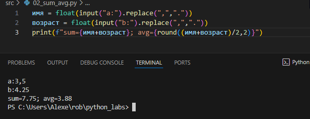


### Задание 3
```python
price= int(input("price="))
discount=int(input("discount="))
vat=int(input("vat="))
base = price * (1 - discount/100)
vat_amount = base * (vat/100)
total = base + vat_amount
print(f"База после скидки: {base} ₽"
      f"\nНДС:               {vat_amount} ₽"
      f"\nИтого к оплате:    {total} ₽")
```
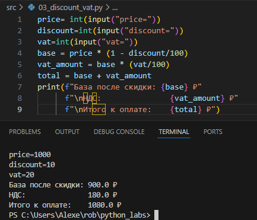


### Задание 4
```python
Минуты=int(input("Минуты: "))
print(Минуты//60,":",Минуты%60,sep="")
```
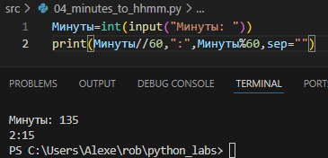


### Задание 5
```python
f =str(input("ФИО:"))
g = f.split()
h = ""
for i in g:
    h+=i[0]
j = f.split(" ")
k= 0
jj=0
for i in j:
    if len(i)!=0:
        k+=1
        jj+=len(i)
print(f"Инициалы: {h}."
      f"\nДлина (символов): {jj+2}")

```
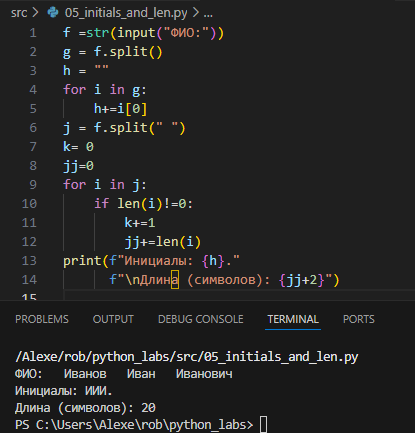


### Задание 6
```python
f = int(input())
q,w=0,0
for i in range(f):
    _,_,_,g = input().split()
    if g == "True":
        q+=1
    else:
        w+=1
print(q,w)
```
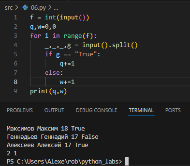


### Задание 7
```python
i = str(input())
q,w=0,0
for t in range(len(i)):
    if i[t].upper() == i[t]:
        q = t
        break

for t in range(len(i)):
    if i[t] in ['0',"1","2","3","4","5",'6',"7","8","9"]:
        w = t+1
        break
print(i[q:len(i):w-q])
```
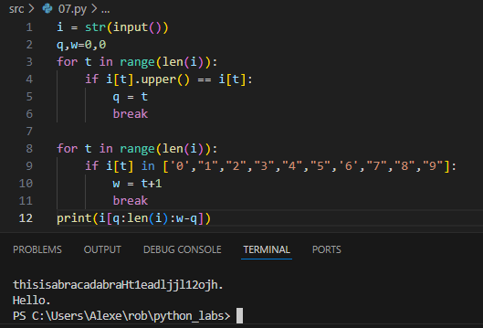

## Лабораторная работа 2

### Задание 1
```python
def min_max(nums: list[float | int]) -> tuple[float | int, float | int]:
    if len(nums) == 0:
        return "ValueError"
    return(min(nums),max(nums))
# Вернуть кортеж (минимум, максимум). Если список пуст — ValueError.

def unique_sorted(nums: list[float | int]) -> list[float | int]:
    nums.sort()
    return(list(set(nums)))
# Вернуть отсортированный список уникальных значений (по возрастанию).

def flatten(mat: list[list | tuple]) -> list:
    temp = []
    for x in mat:
        for y in x:
            if y == str(y):
                return "TypeError"
            temp.append(y)
    return(temp)
# «Расплющить» список списков/кортежей в один список по строкам (row-major). Если встретилась строка/элемент, который не является списком/кортежем — TypeError.

min_max

print(min_max([3, -1, 5, 5, 0]))# → (-1, 5)
print(min_max([42]))# → (42, 42)
print(min_max([-5, -2, -9]))# → (-9, -2)
print(min_max([]))# → ValueError
print(min_max([1.5, 2, 2.0, -3.1]))# → (-3.1, 2)

unique_sorted

print(unique_sorted([3, 1, 2, 1, 3]))# → [1, 2, 3]
print(unique_sorted([]))# → []
print(unique_sorted([-1, -1, 0, 2, 2]))# → [-1, 0, 2]
print(unique_sorted([1.0, 1, 2.5, 2.5, 0]))# → [0, 1.0, 2.5] (допускаем смешение int/float)

flatten

print(flatten([[1, 2], [3, 4]]))# → [1, 2, 3, 4]
print(flatten([[1, 2], (3, 4, 5)]))# → [1, 2, 3, 4, 5]
print(flatten([[1], [], [2, 3]]))# → [1, 2, 3]
print(flatten([[1, 2], "ab"]))# → TypeError («строка не строка строк матрицы»)
```
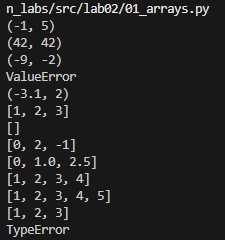

### Задание 2
```python
def transpose(mat: list[list[float | int]]) -> list[list]:
    if mat == []:
        return []
    for i in range(1,len(mat)):
        if len(mat[i]) != len(mat[i-1]):
            return ("ValueError")

    strok = len(mat)
    tabs = len(mat[0])
    resmat = []
    for i in range(tabs):
        resmat.append([0]*strok)
    for x in range(strok):
        for y in range(tabs):
            resmat[y][x] = mat[x][y]
    return resmat
# Поменять строки и столбцы местами. Пустая матрица [] → [].
# Если матрица «рваная» (строки разной длины) — ValueError.

def row_sums(mat: list[list[float | int]]) -> list[float]:
    for i in range(1,len(mat)):
        if len(mat[i]) != len(mat[i-1]):
            return ("ValueError")
    resmat = []
    o=0
    for i in mat:
        for t in i:
            o+=t
        resmat.append(o)
        o = 0
    return resmat
# Сумма по каждой строке. Требуется прямоугольность (см. выше).

def col_sums(mat: list[list[float | int]]) -> list[float]:
    for i in range(1,len(mat)):
        if len(mat[i]) != len(mat[i-1]):
            return ("ValueError")
    strok = len(mat)
    tabs = len(mat[0])
    resmat = []
    o = 0
    for i in range(tabs):
        for t in range(strok):
            o+=mat[t][i]
        resmat.append(o)
        o = 0
    return resmat
# Сумма по каждому столбцу. Требуется прямоугольность.

transpose

print(transpose([[1, 2, 3]])," → [[1], [2], [3]]")
print(transpose([[1], [2], [3]])," → [[1, 2, 3]]")
print(transpose([[1, 2], [3, 4]])," → [[1, 3], [2, 4]]")
print(transpose([])," → []")
print(transpose([[1, 2], [3]])," → ValueError (рваная матрица)")

row_sums

print(row_sums([[1, 2, 3], [4, 5, 6]])," → [6, 15]")
print(row_sums([[-1, 1], [10, -10]])," → [0, 0]")
print(row_sums([[0, 0], [0, 0]])," → [0, 0]")
print(row_sums([[1, 2], [3]])," → ValueError (рваная)")

col_sums

print(col_sums([[1, 2, 3], [4, 5, 6]])," → [5, 7, 9]")
print(col_sums([[-1, 1], [10, -10]])," → [9, -9]")
print(col_sums([[0, 0], [0, 0]])," → [0, 0]")
print(col_sums([[1, 2], [3]])," → ValueError (рваная)")

```
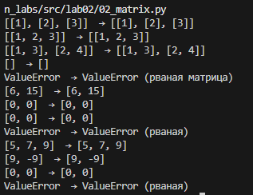


### Задание 3
```python
def format_record(rec: tuple[str, str, float]) -> str:
    for i in range(len(rec)-1):
        if len(rec[i])==0:
            return "ValueError"
    if type(rec[2]) != float:
        return "TypeError"
    
    fio = rec[0].split()

    if len(fio) == 1:
        return "ValueError"
    
    inic = str(fio[0][0].upper())+str(fio[0][1:])+" "
    for i in range(1, len(fio)):
        inic= inic+str(fio[i][0].upper())+"."
    
    round = "{:.2f}".format(rec[2])

    return f"{inic}, гр. {rec[1]}, GPA {round}"


# Вернуть строку вида:
# Иванов И.И., гр. BIVT-25, GPA 4.60
# Правила:

#     ФИО может быть «Фамилия Имя Отчество» или «Фамилия Имя» — инициалы формируются из 1–2 имён (в верхнем регистре).
#     Лишние пробелы нужно убрать (strip, «схлопнуть» внутри).
#     GPA печатается с 2 знаками (округление правилами Python).


print(format_record(("Иванов Иван Иванович", "BIVT-25", 4.6)), "→ 'Иванов И.И., гр. BIVT-25, GPA 4.60'")
print(format_record(("Петров Пётр", "IKBO-12", 5.0)), "→ 'Петров П., гр. IKBO-12, GPA 5.00'")
print(format_record(("Петров Пётр Петрович", "IKBO-12", 5.0)), "→ 'Петров П.П., гр. IKBO-12, GPA 5.00'")
print(format_record(("  сидорова  анна   сергеевна ", "ABB-01", 3.999)), "→ 'Сидорова А.С., гр. ABB-01, GPA 4.00'")
# Некорректные записи (пустое ФИО, пустая группа, неверный тип GPA) → ValueError/TypeError по усмотрению (описать в докстринге).
print(format_record(("", "ABB-01", 3.999)), "→ 'ValueError'")
print(format_record(("Петров", "ABB-01", 3.999)), "→ 'ValueError'")
print(format_record(("Петров Пётр", "", 5.0)), "→ 'ValueError'")
print(format_record(("Петров Пётр", "IKBO-12", 5)), "→ 'TypeError'")
```
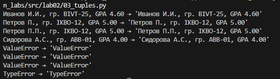


## Лабораторная работа 3


### Задание 1
```python
def normalize(text: str, *, casefold: bool = True, yo2e: bool = True) -> str:
    
    if yo2e:
        for i in range(len(text)):
            if text[i] == "ё":
                text = text[:i]+"е"+text[i+1:]
            elif text[i] == "Ё":
                text = text[:i]+"Е"+text[i+1:]
    if casefold:
        text = text.casefold()
    
    text = " ".join(text.split())
    return text

# Если casefold=True — привести к casefold (лучше, чем lower для Юникода).
# Если yo2e=True — заменить все ё/Ё на е/Е.
# Убрать невидимые управляющие символы (например, \t, \r) → заменить на пробелы, схлопнуть повторяющиеся пробелы в один.

import re

def tokenize(text: str) -> list[str]:
    g = ''
    # h = 0
    for i in range(len(text)):
        # if h == 1:
        #     h = 0
        #     continue
        if text[i]+"g" == "\g":
            text = text[:i]+"  "+text[i+2:]
            # h=1
        elif not(re.fullmatch(r"[\w-]", text[i])):
            text = text[:i]+" "+text[i+1:]
    text = text.split()
    return text


# Разбить на «слова» по небуквенно-цифровым разделителям.
# В качестве слова считаем последовательности символов \w (буквы/цифры/подчёркивание) плюс дефис внутри слова (например, по-настоящему).
# Числа (например, 2025) считаем словами.

def count_freq(tokens: list[str]) -> dict[str, int]:
    freq: dict[str, int] = {}
    for t in tokens:
        if t in freq:
            freq[t.replace("ё","е")] += 1
        else:
            freq[t.replace("ё","е")] = 1
    return dict(sorted(freq.items()))


def top_n(freq: dict[str, int], n: int = 5) -> list[tuple[str, int]]:
    pairs: list[tuple[int, str]] = []
    for w, c in freq.items():
        pairs.append((-c, w))  
    pairs.sort() 
    result: list[tuple[str, int]] = []
    i = 0
    for c, w in pairs:
        if i >= n:
            break
        result.append((w, -c))
        i += 1
    return result


# Вернуть топ-N по убыванию частоты; при равенстве — по алфавиту слова.
```


### Задание 2
```python
from ..lib.text import normalize, tokenize, count_freq, top_n

# normalize
assert normalize("ПрИвЕт\nМИр\t") == "привет мир"
assert normalize("ёжик, Ёлка") == "ежик, елка"

# tokenize
assert tokenize("привет, мир!") == ["привет", "мир"]
assert tokenize("по-настоящему круто") == ["по-настоящему", "круто"]
assert tokenize("2025 год") == ["2025", "год"]

# count_freq + top_n
freq = count_freq(["a","b","a","c","b","a"])
assert freq == {"a":3,"b":2,"c":1}
assert top_n(freq, 2) == [("a",3), ("b",2)]

# тай-брейк по слову при равной частоте
freq2 = count_freq(["bb","aa","bb","aa","cc"])
assert top_n(freq2, 2) == [("aa",2), ("bb",2)]

print("OK")


# cd /home/mol/Desktop/python_labs                                       main        
# python -m src.lab03.test_text
```
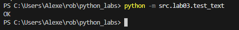


### Задание 3
```python
# src/lab03/text_stats.py
import sys
from ..lib.text import normalize, tokenize, count_freq, top_n

def main() -> None:
    text = str(sys.stdin.read())
    # text2 = 'Привет, мир! Привет!!!\n'
    tokens = tokenize(normalize(text))
    freq = count_freq(tokens)

    print(f"Всего слов: {len(tokens)}")
    print(f"Уникальных слов: {len(set(tokens))}")
    print("Топ-5:")
    for w, c in sorted(freq.items())[::-1]:
        print(f"{w}:{c}")

if __name__ == "__main__":
    main()
```
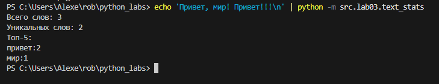


## Лабораторная работа 4

### Задание 1
```python
from src.lib.text import normalize, tokenize, count_freq, top_n

from pathlib import Path

def read_text(path: str | Path, encoding: str = "utf-8") -> str:
    p = Path(path)
    # FileNotFoundError и UnicodeDecodeError пусть «всплывают» — это нормально
    return p.read_text(encoding=encoding)

import csv
from pathlib import Path
from typing import Iterable, Sequence

def write_csv(rows: Iterable[Sequence], path: str | Path,
              header: tuple[str, ...] | None = None) -> None:
    p = Path(path)
    rows = list(rows)
    with p.open("w", newline="", encoding="utf-8") as f:
        w = csv.writer(f)
        if header is not None:
            w.writerow(header)
        for r in rows:
            w.writerow(r)

txt = read_text("data/lab04/input.txt")  # должен вернуть строку
print(txt)
write_csv([("word","count"),("test",3)], "data/lab04/check.csv")  # создаст CSV
```
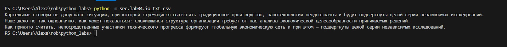
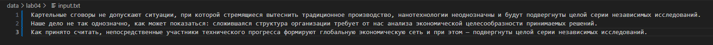
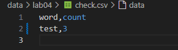

### Задание 2
```python
from src.lab04.io_txt_csv import read_text, write_csv
from ..lib.text import normalize, tokenize, count_freq, top_n


txt = read_text("data/lab04/input.txt")
if txt == "":
    print()
    op = [("word","count")]
    write_csv(op, "data/lab04/check.csv")
else:
    text = txt
    tokens = tokenize(normalize(text))
    freq = count_freq(tokens)

    print(f"Всего слов: {len(tokens)}")
    print(f"Уникальных слов: {len(set(tokens))}")
    print("Топ-5:")
    op = [("word","count")]
    for w, c in top_n(freq):
        op.append((w,c))
        print(f"{w}:{c}")

    write_csv(op, "data/lab04/check.csv")
```
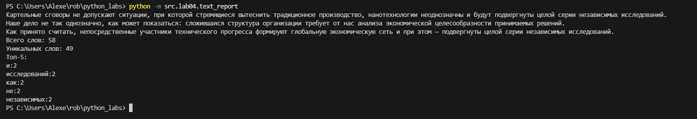
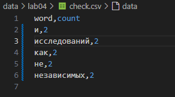


## Лабораторная работа 5

### Задание 1
```python
from pathlib import Path
import json
import csv
from typing import Any

# from src.lib.text import normalize, tokenize, count_freq, top_n

def json_to_csv(json_path: str | Path, csv_path: str | Path) -> None:
    p_json = Path(json_path)
    p_csv = Path(csv_path)

    # if tokenize(p_json)[-1].lower() != "json" or tokenize(p_csv)[-1].lower() != "csv":
    if p_json.suffix.lower() != ".json" or p_csv.suffix.lower() != ".csv":
        raise ValueError("Неверный тип файла: ожидаются .json (вход) и .csv (выход).")

    with p_json.open(encoding="utf-8") as jf:
        try:
            data: Any = json.load(jf)
        except json.JSONDecodeError as e:
            raise ValueError(f"Некорректный JSON: {e}") from e

    if not isinstance(data, list) or len(data) == 0:
        raise ValueError("Пустой JSON или неподдерживаемая структура (нужен непустой список объектов).")

    for i, item in enumerate(data):
        if not isinstance(item, dict):
            raise ValueError(f"JSON должен быть списком словарей; элемент #{i} имеет тип {type(item).__name__}.")

    keys: set[str] = set()
    for obj in data:
        keys.update(obj.keys())
    fieldnames = sorted(keys)

    with p_csv.open("w", newline="", encoding="utf-8") as cf:
        writer = csv.DictWriter(cf, fieldnames=fieldnames)
        writer.writeheader()
        for obj in data:
            row = {k: obj.get(k, "") for k in fieldnames}
            writer.writerow(row)


def _sniff_dialect(sample: str) -> csv.Dialect:
    try:
        return csv.Sniffer().sniff(sample, delimiters=",;")
    except csv.Error:
        return csv.get_dialect("excel")

def csv_to_json(csv_path: str | Path, json_path: str | Path) -> None:
    p_csv = Path(csv_path)
    p_json = Path(json_path)

    if p_csv.suffix.lower() != ".csv" or p_json.suffix.lower() != ".json":
        raise ValueError("Неверный тип файла: ожидаются .csv (вход) и .json (выход).")

    with p_csv.open(encoding="utf-8") as f:
        sample = f.read(4096)
        if not sample.strip():
            raise ValueError("Пустой CSV.")
        f.seek(0)
        dialect = _sniff_dialect(sample)
        reader = csv.DictReader(f, dialect=dialect)

        if not reader.fieldnames or all((h or "").strip() == "" for h in reader.fieldnames):
            raise ValueError("CSV без заголовка.")

        rows = [{k: (v if v is not None else "") for k, v in row.items()} for row in reader]

    if len(rows) == 0:
        raise ValueError("CSV не содержит строк данных.")

    with p_json.open("w", encoding="utf-8") as jf:
        json.dump(rows, jf, ensure_ascii=False, indent=2)


json_to_csv('data/samples/people.json','data/out/people_from_json.csv')
csv_to_json('data/samples/people.csv','data/out/people_from_csv.json')
```
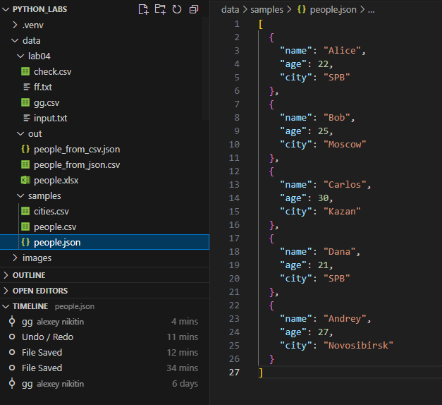
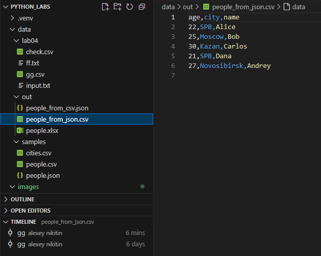
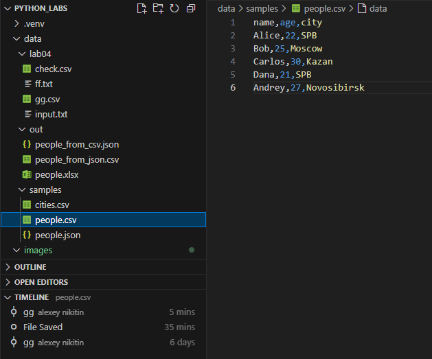
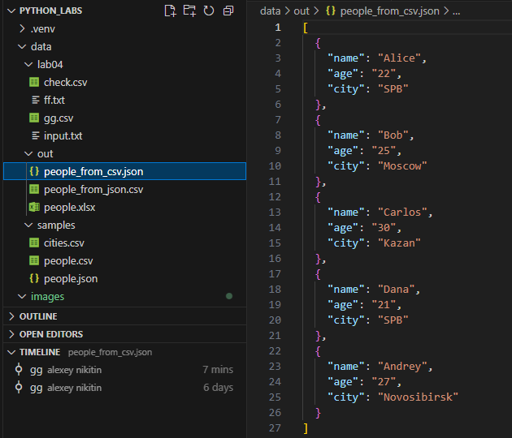


### Задание 2
```python
from pathlib import Path
import csv
from openpyxl import Workbook
from openpyxl.utils import get_column_letter

def csv_to_xlsx(csv_path: str | Path, xlsx_path: str | Path) -> None:
    p_csv = Path(csv_path)
    p_xlsx = Path(xlsx_path)

    if p_csv.suffix.lower() != ".csv" or p_xlsx.suffix.lower() != ".xlsx":
        raise ValueError("Неверный тип файла: ожидаются .csv (вход) и .xlsx (выход).")

    with p_csv.open(encoding="utf-8") as f:
        sample = f.read(4096)
        if not sample.strip():
            raise ValueError("Пустой CSV.")
        f.seek(0)
        try:
            dialect = csv.Sniffer().sniff(sample, delimiters=",;")
        except csv.Error:
            dialect = csv.get_dialect("excel")
        reader = csv.reader(f, dialect=dialect)
        rows = list(reader)

    if not rows:
        raise ValueError("CSV пуст.")
    header = rows[0]
    if not header or all((h or "").strip() == "" for h in header):
        raise ValueError("CSV без заголовка.")

    wb = Workbook()
    ws = wb.active
    ws.title = "Sheet1"

    for row in rows:
        ws.append(row)

    # Автоширина колонок
    col_widths = [0] * len(header)
    for row in rows:
        for i, cell in enumerate(row):
            length = len(str(cell)) if cell is not None else 0
            if i >= len(col_widths):
                col_widths.extend([0] * (i + 1 - len(col_widths)))
            if length > col_widths[i]:
                col_widths[i] = length

    for i, width in enumerate(col_widths, start=1):
        ws.column_dimensions[get_column_letter(i)].width = max(8, width)

    wb.save(p_xlsx)

csv_to_xlsx('data/samples/people.csv','data/out/people.xlsx')
```


## Лабораторная работа 6

### cli_text.py
```python
import argparse
from pathlib import Path
import sys

from src.lib.text import normalize, tokenize, count_freq


def main() -> None:
    parser = argparse.ArgumentParser(description="CLI-утилиты лабораторной №6")
    subparsers = parser.add_subparsers(dest="command")

    # подкоманда cat
    cat_parser = subparsers.add_parser("cat", help="Вывести содержимое файла")
    cat_parser.add_argument("--input", required=True, help="Путь к файлу")
    cat_parser.add_argument("-n", action="store_true", help="Нумеровать строки")

    # подкоманда stats
    stats_parser = subparsers.add_parser("stats", help="Частоты слов")
    stats_parser.add_argument("--input", required=True, help="Путь к текстовому файлу")
    stats_parser.add_argument("--top", type=int, default=5, help="Сколько слов вывести")

    args = parser.parse_args()

    if args.command == "cat":
        path = Path(args.input)
        try:
            with path.open(encoding="utf-8") as f:
                if args.n:
                    for i, line in enumerate(f, start=1):
                        print(f"{i}\t{line.rstrip()}")
                else:
                    for line in f:
                        print(line.rstrip())
        except FileNotFoundError:
            print(f"Ошибка: файл не найден: {path}", file=sys.stderr)
            sys.exit(1)
    elif args.command == "stats":
        path = Path(args.input)
        try:
            text = path.read_text(encoding="utf-8")
        except FileNotFoundError:
            print(f"Ошибка: файл не найден: {path}", file=sys.stderr)
            sys.exit(1)

        text_norm = normalize(text)
        tokens = tokenize(text_norm)
        freqs = count_freq(tokens)

        if args.top <= 0:
            print("Ошибка: значение --top должно быть > 0", file=sys.stderr)
            sys.exit(2)

        items = sorted(freqs.items(), key=lambda kv: kv[1], reverse=True)[: args.top]
        for word, cnt in items:
            print(f"{word}\t{cnt}")
    else:
        #help
        parser.print_help()


if __name__ == "__main__":
    main()
```


### cli_convert.py
```python
import argparse
from pathlib import Path
import sys

from src.lab05.json_csv import json_to_csv, csv_to_json
from src.lab05.csv_xlsx import csv_to_xlsx


def ensure_input(path: Path) -> None:
    if not path.exists():
        print(f"Ошибка: входной файл не найден: {path}", file=sys.stderr)
        sys.exit(1)


def prepare_output(path: Path) -> None:
    if path.parent:
        path.parent.mkdir(parents=True, exist_ok=True)


def main() -> None:
    parser = argparse.ArgumentParser(description="Конвертеры данных")
    sub = parser.add_subparsers(dest="cmd")

    p1 = sub.add_parser("json2csv", help="Преобразовать JSON → CSV")
    p1.add_argument("--in", dest="input", required=True, help="Входной JSON-файл")
    p1.add_argument("--out", dest="output", required=True, help="Выходной CSV-файл")

    p2 = sub.add_parser("csv2json", help="Преобразовать CSV → JSON")
    p2.add_argument("--in", dest="input", required=True, help="Входной CSV-файл")
    p2.add_argument("--out", dest="output", required=True, help="Выходной JSON-файл")

    p3 = sub.add_parser("csv2xlsx", help="Преобразовать CSV → XLSX")
    p3.add_argument("--in", dest="input", required=True, help="Входной CSV-файл")
    p3.add_argument("--out", dest="output", required=True, help="Выходной XLSX-файл")

    args = parser.parse_args()

    if args.cmd == "json2csv":
        src = Path(args.input)
        dst = Path(args.output)
        ensure_input(src)
        prepare_output(dst)
        try:
            json_to_csv(src, dst)
        except ValueError as e:
            print(f"Ошибка конвертации JSON → CSV: {e}", file=sys.stderr)
            sys.exit(2)

    elif args.cmd == "csv2json":
        src = Path(args.input)
        dst = Path(args.output)
        ensure_input(src)
        prepare_output(dst)
        try:
            csv_to_json(src, dst)
        except ValueError as e:
            print(f"Ошибка конвертации CSV → JSON: {e}", file=sys.stderr)
            sys.exit(2)

    elif args.cmd == "csv2xlsx":
        src = Path(args.input)
        dst = Path(args.output)
        ensure_input(src)
        prepare_output(dst)
        try:
            csv_to_xlsx(src, dst)
        except ValueError as e:
            print(f"Ошибка конвертации CSV → XLSX: {e}", file=sys.stderr)
            sys.exit(2)

    else:
        parser.print_help()


if __name__ == "__main__":
    main()
```

### out
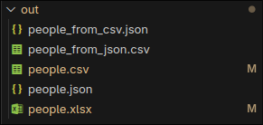

### cli_text


### cli_convert json2csv
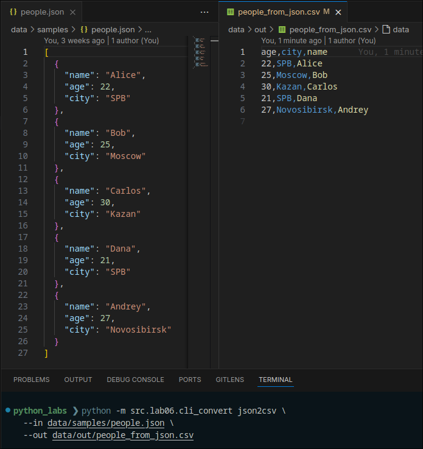

### cli_convert csv2json
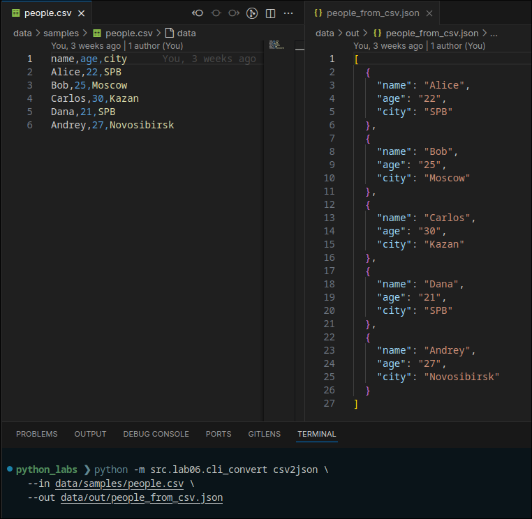

### cli_convert csv2xlsx


## Лабораторная работа 7


### python -m venv .venv
```
python_labs ❯ python -m venv .venv
source .venv/bin/activate           # Windows: .venv\Scripts\activate
python -m pip install pytest pytest-cov black

Requirement already satisfied: pytest in ./.venv/lib/python3.13/site-packages (9.0.1)
Requirement already satisfied: pytest-cov in ./.venv/lib/python3.13/site-packages (7.0.0)
Requirement already satisfied: black in ./.venv/lib/python3.13/site-packages (25.11.0)
Requirement already satisfied: iniconfig>=1.0.1 in ./.venv/lib/python3.13/site-packages (from pytest) (2.3.0)
Requirement already satisfied: packaging>=22 in ./.venv/lib/python3.13/site-packages (from pytest) (25.0)
Requirement already satisfied: pluggy<2,>=1.5 in ./.venv/lib/python3.13/site-packages (from pytest) (1.6.0)
Requirement already satisfied: pygments>=2.7.2 in ./.venv/lib/python3.13/site-packages (from pytest) (2.19.2)
Requirement already satisfied: coverage>=7.10.6 in ./.venv/lib/python3.13/site-packages (from coverage[toml]>=7.10.6->pytest-cov) (7.12.0)
Requirement already satisfied: click>=8.0.0 in ./.venv/lib/python3.13/site-packages (from black) (8.3.1)
Requirement already satisfied: mypy-extensions>=0.4.3 in ./.venv/lib/python3.13/site-packages (from black) (1.1.0)
Requirement already satisfied: pathspec>=0.9.0 in ./.venv/lib/python3.13/site-packages (from black) (0.12.1)
Requirement already satisfied: platformdirs>=2 in ./.venv/lib/python3.13/site-packages (from black) (4.5.0)
Requirement already satisfied: pytokens>=0.3.0 in ./.venv/lib/python3.13/site-packages (from black) (0.3.0)
```

### pytest -ra
```
python_labs ❯ pytest -ra

================================================================================= test session starts ==================================================================================
platform linux -- Python 3.13.7, pytest-9.0.1, pluggy-1.6.0
rootdir: /home/mol/Desktop/python_labs
configfile: pyproject.toml
testpaths: tests
plugins: cov-7.0.0
collected 24 items                                                                                                                                                                     

tests/test_json_csv.py ..........                                                                                                                                                [ 41%]
tests/test_text.py ..............                                                                                                                                                [100%]

================================================================================== 24 passed in 0.05s ==================================================================================
```

### black --check .
```
python_labs ❯ black --check .
No Python files are present to be formatted. Nothing to do 😴
```

### pytest --cov=src --cov-report=term-missing
```
python_labs ❯ pytest --cov=src --cov-report=term-missing  
================================================================================= test session starts ==================================================================================
platform linux -- Python 3.13.7, pytest-9.0.1, pluggy-1.6.0
rootdir: /home/mol/Desktop/python_labs
configfile: pyproject.toml
testpaths: tests
plugins: cov-7.0.0
collected 24 items                                                                                                                                                                     

tests/test_json_csv.py ..........                                                                                                                                                [ 41%]
tests/test_text.py ..............                                                                                                                                                [100%]

==================================================================================== tests coverage ====================================================================================
___________________________________________________________________ coverage: platform linux, python 3.13.7-final-0 ____________________________________________________________________

Name                       Stmts   Miss  Cover   Missing
--------------------------------------------------------
src/lab05/__init__.py          0      0   100%
src/lab05/csv_xlsx.py         42     42     0%   1-53
src/lab05/json_csv.py         56      6    89%   30, 50-51, 75, 82-83
src/lab06/__init__.py          0      0   100%
src/lab06/cli_convert.py      58     58     0%   1-76
src/lab06/cli_text.py         45     45     0%   1-62
src/lib/text.py               40      1    98%   31
--------------------------------------------------------
TOTAL                        241    152    37%
================================================================================== 24 passed in 0.10s ==================================================================================
```


## Лабораторная работа 8

### models.py 
```python
from __future__ import annotations

from dataclasses import dataclass, field
from datetime import date
from typing import Any, Dict


@dataclass
class Student:
    fio: str
    birthdate: str 
    group: str
    gpa: float
    _birthdate_date: date = field(init=False, repr=False)

    def __post_init__(self) -> None:
        try:
            parsed_birthdate = date.fromisoformat(self.birthdate)
        except (TypeError, ValueError) as exc:
            raise ValueError("birthdate must be in YYYY-MM-DD format") from exc

        if not (0 <= self.gpa <= 5):
            raise ValueError("gpa must be between 0 and 5")

        self._birthdate_date = parsed_birthdate

    def age(self) -> int:
        today = date.today()
        years = today.year - self._birthdate_date.year
        if (today.month, today.day) < (self._birthdate_date.month, self._birthdate_date.day):
            years -= 1
        return years

    def to_dict(self) -> Dict[str, Any]:
        return {
            "fio": self.fio,
            "birthdate": self.birthdate,
            "group": self.group,
            "gpa": self.gpa,
        }

    @classmethod
    def from_dict(cls, data: Dict[str, Any]) -> "Student":
        required_keys = {"fio", "birthdate", "group", "gpa"}
        if not required_keys.issubset(data):
            missing = required_keys - set(data)
            raise ValueError(f"Missing fields for Student: {', '.join(sorted(missing))}")

        try:
            fio = str(data["fio"])
            birthdate = str(data["birthdate"])
            group = str(data["group"])
            gpa = float(data["gpa"])
        except (TypeError, ValueError) as exc:
            raise ValueError("Invalid field types for Student") from exc

        return cls(fio=fio, birthdate=birthdate, group=group, gpa=gpa)

    def __str__(self) -> str:
        return f"{self.fio} ({self.group}) — born {self.birthdate}, GPA: {self.gpa:.2f}"


if __name__ == "__main__":
    example_student = Student(
        fio="Иванов Иван",
        birthdate="2003-10-10",
        group="БИВТ-21-1",
        gpa=4.5,
    )
    print(example_student)
    print(f"Age: {example_student.age()}")
    print("As dict:", example_student.to_dict())
```

### serialize.py 
```python
from __future__ import annotations

import json
from pathlib import Path
from typing import Iterable, List

from .models import Student


def students_to_json(students: Iterable[Student], path: str | Path) -> None:
    student_list: List[Student] = list(students)
    if not all(isinstance(student, Student) for student in student_list):
        raise TypeError("students_to_json expects an iterable of Student objects")

    data = [student.to_dict() for student in student_list]
    output_path = Path(path)
    output_path.parent.mkdir(parents=True, exist_ok=True)
    with output_path.open("w", encoding="utf-8") as file:
        json.dump(data, file, ensure_ascii=False, indent=2)


def students_from_json(path: str | Path) -> List[Student]:
    input_path = Path(path)
    with input_path.open(encoding="utf-8") as file:
        raw_data = json.load(file)

    if not isinstance(raw_data, list):
        raise ValueError("JSON file must contain a list of students")

    students: List[Student] = []
    for entry in raw_data:
        if not isinstance(entry, dict):
            raise ValueError("Each student entry must be an object")
        students.append(Student.from_dict(entry))

    return students


if __name__ == "__main__":
    demo_students = [
        Student("Иванов Иван", "2003-10-10", "БИВТ-21-1", 4.3),
        Student("Петров Петр", "2002-05-12", "БИВТ-21-2", 4.7),
    ]
    output = Path("data/lab08/students_demo.json")
    students_to_json(demo_students, output)
    print(f"Saved {len(demo_students)} students to {output}")
    loaded = students_from_json(output)
    print("Loaded:")
    for student in loaded:
        print(" -", student)
```

### файл students
```
[
  {
    "fio": "Иванов Иван Иванович",
    "birthdate": "2002-04-15",
    "group": "SE-01",
    "gpa": 4.5
  },
  {
    "fio": "Петрова Анна Сергеевна",
    "birthdate": "2003-11-02",
    "group": "SE-02",
    "gpa": 4.8
  },
  {
    "fio": "Smith John",
    "birthdate": "2001-07-22",
    "group": "DS-03",
    "gpa": 3.9
  }
]
```


### запуск __name__ == "__main__"
``` 
python_labs ❯ python -m src.lab08.models                     
Иванов Иван (БИВТ-21-1) — born 2003-10-10, GPA: 4.50
Age: 22
As dict: {'fio': 'Иванов Иван', 'birthdate': '2003-10-10', 'group': 'БИВТ-21-1', 'gpa': 4.5}

python_labs ❯ python -m src.lab08.serialize                          
Saved 2 students to data/lab08/students_demo.json
Loaded:
 - Иванов Иван (БИВТ-21-1) — born 2003-10-10, GPA: 4.30
 - Петров Петр (БИВТ-21-2) — born 2002-05-12, GPA: 4.70
```


## Лабораторная работа 9

### group.py 
```python
from __future__ import annotations

import csv
from pathlib import Path
from typing import Iterable, List

from src.lab08.models import Student


class Group:

    header = ["fio", "birthdate", "group", "gpa"]

    def __init__(self, storage_path: str | Path):
        self.path = Path(storage_path)
        self._ensure_storage_exists()

    def _ensure_storage_exists(self) -> None:
        self.path.parent.mkdir(parents=True, exist_ok=True)
        if not self.path.exists():
            with self.path.open("w", newline="", encoding="utf-8") as file:
                writer = csv.writer(file)
                writer.writerow(self.header)

    def _validate_header(self, fieldnames: Iterable[str] | None) -> None:
        if list(fieldnames or []) != self.header:
            raise ValueError(
            )

    def _read_all(self) -> List[Student]:
        with self.path.open(newline="", encoding="utf-8") as file:
            reader = csv.DictReader(file)
            self._validate_header(reader.fieldnames)
            students: List[Student] = []
            for row in reader:
                if not row:
                    continue
                students.append(
                    Student.from_dict(
                        {
                            "fio": row.get("fio", ""),
                            "birthdate": row.get("birthdate", ""),
                            "group": row.get("group", ""),
                            "gpa": row.get("gpa", 0),
                        }
                    )
                )
            return students

    def _write_students(self, students: Iterable[Student]) -> None:
        with self.path.open("w", newline="", encoding="utf-8") as file:
            writer = csv.DictWriter(file, fieldnames=self.header)
            writer.writeheader()
            for student in students:
                writer.writerow(student.to_dict())

    def list(self) -> List[Student]:

        return self._read_all()

    def add(self, student: Student) -> None:

        if not isinstance(student, Student):
            raise TypeError("add() expects a Student instance")

        students = self._read_all()
        students.append(student)
        self._write_students(students)

    def find(self, substr: str) -> List[Student]:

        needle = substr.lower()
        return [s for s in self._read_all() if needle in s.fio.lower()]

    def remove(self, fio: str) -> int:

        students = self._read_all()
        remaining = [s for s in students if s.fio != fio]
        removed = len(students) - len(remaining)
        if removed:
            self._write_students(remaining)
        return removed

    def update(self, fio: str, **fields) -> bool:

        students = self._read_all()
        updated = False
        for idx, student in enumerate(students):
            if student.fio == fio:
                data = student.to_dict()
                data.update(fields)
                students[idx] = Student.from_dict(data)
                updated = True
                break
        if updated:
            self._write_students(students)
        return updated

    def stats(self) -> dict:

        students = self._read_all()
        if not students:
            return {
                "count": 0,
                "min_gpa": None,
                "max_gpa": None,
                "avg_gpa": None,
                "groups": {},
                "top_5_students": [],
            }

        gpas = [s.gpa for s in students]
        groups_count: dict[str, int] = {}
        for student in students:
            groups_count[student.group] = groups_count.get(student.group, 0) + 1

        top_students = sorted(students, key=lambda s: s.gpa, reverse=True)[:5]
        return {
            "count": len(students),
            "min_gpa": min(gpas),
            "max_gpa": max(gpas),
            "avg_gpa": sum(gpas) / len(gpas),
            "groups": groups_count,
            "top_5_students": [
                {"fio": s.fio, "gpa": s.gpa} for s in top_students
            ],
        }


if __name__ == "__main__":
    demo_path = Path("data/lab09/students_demo.csv")
    group = Group(demo_path)

    group._write_students([]) 
    group.add(Student("Иванов Иван", "2003-10-10", "БИВТ-21-1", 4.3))
    group.add(Student("Петров Петр", "2002-05-12", "БИВТ-21-2", 4.7))
    group.add(Student("Сидорова Анна", "2004-07-01", "БИВТ-21-1", 4.9))

    print("All students:")
    for s in group.list():
        print(" -", s)

    print("\nFind 'Иван':")
    for s in group.find("Иван"):
        print(" *", s)

    print("\nUpdating GPA for Петров Петр to 4.9...")
    group.update("Петров Петр", gpa=4.9)
    print("Updated entry:")
    for s in group.find("Петров"):
        print(" *", s)

    print("\nRemoving Сидорова Анна")
    group.remove("Сидорова Анна")
    for s in group.list():
        print(" -", s)

    print("\nStats:")
    print(group.stats())

```

### students.csv
```
fio,birthdate,group,gpa
Иванов Иван,2003-10-10,БИВТ-21-1,4.3
Петрова Анна,2002-04-15,SE-01,4.8
Сидоров Павел,2004-06-02,BD-01,3.9
```


### python -m src.lab09.group
```
python_labs ❯ python -m src.lab09.group    
All students:
 - Иванов Иван (БИВТ-21-1) — born 2003-10-10, GPA: 4.30
 - Петров Петр (БИВТ-21-2) — born 2002-05-12, GPA: 4.70
 - Сидорова Анна (БИВТ-21-1) — born 2004-07-01, GPA: 4.90

Find 'Иван':
 * Иванов Иван (БИВТ-21-1) — born 2003-10-10, GPA: 4.30

Updating GPA for Петров Петр to 4.9...
Updated entry:
 * Петров Петр (БИВТ-21-2) — born 2002-05-12, GPA: 4.90

Removing Сидорова Анна
 - Иванов Иван (БИВТ-21-1) — born 2003-10-10, GPA: 4.30
 - Петров Петр (БИВТ-21-2) — born 2002-05-12, GPA: 4.90

Stats:
{'count': 2, 'min_gpa': 4.3, 'max_gpa': 4.9, 'avg_gpa': 4.6, 'groups': {'БИВТ-21-1': 1, 'БИВТ-21-2': 1}, 'top_5_students': [{'fio': 'Петров Петр', 'gpa': 4.9}, {'fio': 'Иванов Иван', 'gpa': 4.3}]}
```


## Лабораторная работа 10

### structures.py
```python
from collections import deque
from typing import Any, Iterable


class Stack:

    def __init__(self, items: Iterable[Any] | None = None) -> None:
        self._data: list[Any] = list(items) if items is not None else []

    def push(self, item: Any) -> None:
        self._data.append(item)

    def pop(self) -> Any:
        if not self._data:
            raise IndexError("Stack is empty")
        return self._data.pop()

    def peek(self) -> Any | None:
        return self._data[-1] if self._data else None

    def is_empty(self) -> bool:
        return not self._data

    def __len__(self) -> int: 
        return len(self._data)

    def __repr__(self) -> str: 
        return f"Stack({self._data!r})"


class Queue:

    def __init__(self, items: Iterable[Any] | None = None) -> None:
        self._data: deque[Any] = deque(items or [])

    def enqueue(self, item: Any) -> None:
        self._data.append(item)

    def dequeue(self) -> Any:
        if not self._data:
            raise IndexError("Queue is empty")
        return self._data.popleft()

    def peek(self) -> Any | None:
        return self._data[0] if self._data else None

    def is_empty(self) -> bool:
        return not self._data

    def __len__(self) -> int: 
        return len(self._data)

    def __repr__(self) -> str: 
        return f"Queue({list(self._data)!r})"


if __name__ == "__main__":
    print("--- Stack demo ---")
    stack = Stack([1, 2, 3])
    print("Initial:", stack)
    stack.push(4)
    print("After push:", stack)
    print("Peek:", stack.peek())
    print("Pop:", stack.pop())
    print("Final:", stack)

    print("\n--- Queue demo ---")
    queue = Queue(["a", "b", "c"])
    print("Initial:", queue)
    queue.enqueue("d")
    print("After enqueue:", queue)
    print("Peek:", queue.peek())
    print("Dequeue:", queue.dequeue())
    print("Final:", queue)
```

### linked_list.py
```python
from __future__ import annotations

from typing import Any, Iterable, Iterator


class Node:

    __slots__ = ("value", "next")

    def __init__(self, value: Any, next: Node | None = None) -> None:
        self.value = value
        self.next = next

    def __repr__(self) -> str:  
        return f"Node({self.value!r})"


class SinglyLinkedList:

    def __init__(self, values: Iterable[Any] | None = None) -> None:
        self.head: Node | None = None
        self.tail: Node | None = None
        self._size: int = 0
        if values is not None:
            for value in values:
                self.append(value)

    def append(self, value: Any) -> None:
        new_node = Node(value)
        if self.head is None:
            self.head = self.tail = new_node
        else:
            assert self.tail is not None 
            self.tail.next = new_node
            self.tail = new_node
        self._size += 1

    def prepend(self, value: Any) -> None:
        new_node = Node(value, self.head)
        self.head = new_node
        if self.tail is None:
            self.tail = new_node
        self._size += 1

    def insert(self, idx: int, value: Any) -> None:
        if idx < 0 or idx > self._size:
            raise IndexError("Index out of range")
        if idx == 0:
            self.prepend(value)
            return
        if idx == self._size:
            self.append(value)
            return

        prev = self._node_at(idx - 1)
        new_node = Node(value, prev.next)
        prev.next = new_node
        self._size += 1

    def remove(self, value: Any) -> None:
        if self.head is None:
            raise ValueError("List is empty")

        if self.head.value == value:
            self.head = self.head.next
            if self.head is None:
                self.tail = None
            self._size -= 1
            return

        prev = self.head
        current = self.head.next
        while current is not None:
            if current.value == value:
                prev.next = current.next
                if current is self.tail:
                    self.tail = prev
                self._size -= 1
                return
            prev, current = current, current.next

        raise ValueError(f"{value!r} not found in list")

    def _node_at(self, idx: int) -> Node:
        current = self.head
        for _ in range(idx):
            assert current is not None 
            current = current.next
        assert current is not None
        return current

    def __iter__(self) -> Iterator[Any]:
        current = self.head
        while current is not None:
            yield current.value
            current = current.next

    def __len__(self) -> int: 
        return self._size

    def __repr__(self) -> str: 
        return f"SinglyLinkedList([{', '.join(repr(v) for v in self)}])"

    def __str__(self) -> str: 
        parts = []
        current = self.head
        while current is not None:
            parts.append(f"[{current.value!r}]")
            current = current.next
        parts.append("None")
        return " -> ".join(parts)


if __name__ == "__main__":
    ll = SinglyLinkedList([1, 2, 4])
    print("Initial:", ll)
    ll.prepend(0)
    ll.append(5)
    ll.insert(3, 3)
    print("After modifications:", ll)
    ll.remove(2)
    print("After removing 2:", ll)
    print("Length:", len(ll))
    print("Iterating:", list(ll))
```

### python -m src.lab10.structures
```
python_labs ❯ python -m src.lab10.structures                               
--- Stack demo ---
Initial: Stack([1, 2, 3])
After push: Stack([1, 2, 3, 4])
Peek: 4
Pop: 4
Final: Stack([1, 2, 3])

--- Queue demo ---
Initial: Queue(['a', 'b', 'c'])
After enqueue: Queue(['a', 'b', 'c', 'd'])
Peek: a
Dequeue: a
Final: Queue(['b', 'c', 'd'])
```

### python -m src.lab10.linked_list
```
python_labs ❯ python -m src.lab10.linked_list                                    
Initial: [1] -> [2] -> [4] -> None
After modifications: [0] -> [1] -> [2] -> [3] -> [4] -> [5] -> None
After removing 2: [0] -> [1] -> [3] -> [4] -> [5] -> None
Length: 5
Iterating: [0, 1, 3, 4, 5]
```


